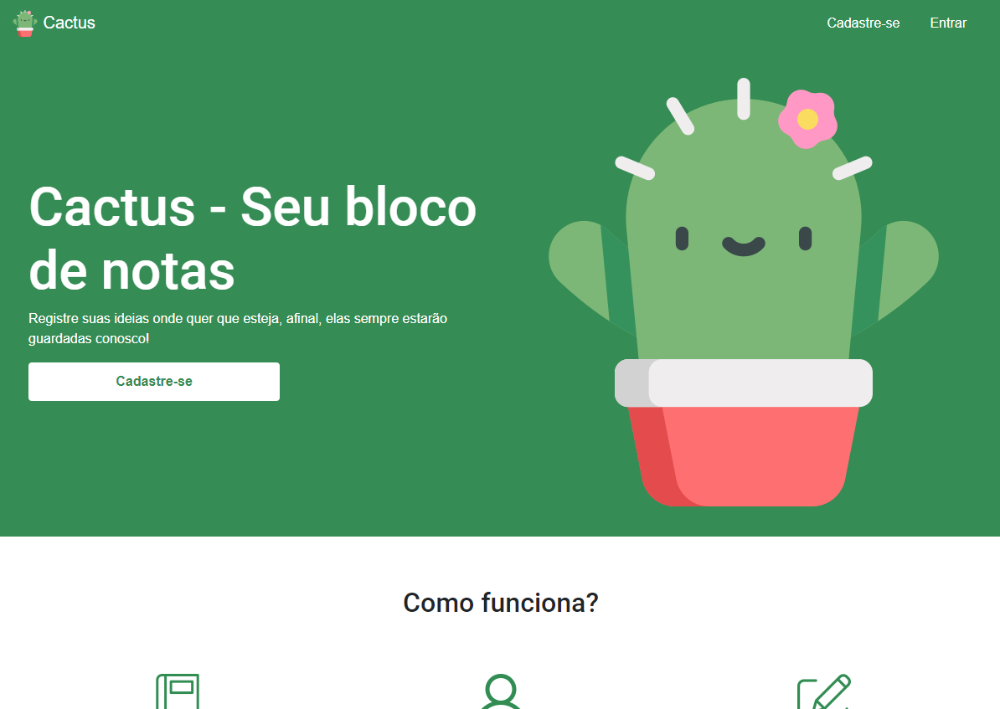
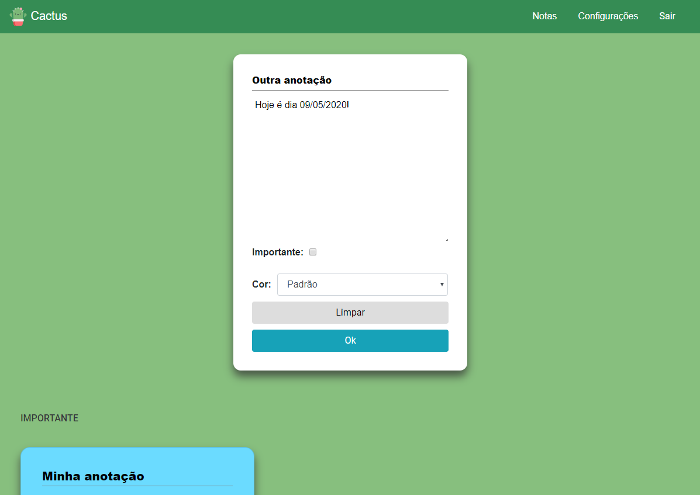

# Cactus - Seu bloco de notas
Iniciei este projeto visando aprender mais sobre Prepared Statements, Programação Orientada a Objetos (POO) em PHP e SASS. Para tanto criei Cactus, um bloco de notas online inspirado no Google Keep.

Como não foi utilizado nenhum framework, com certeza há brechas de segurança e entre outras características que não tornam o projeto muito seguro. Isso pode ser objeto de estudo de uma nova refatoração. 

As principais funcionalidades do Cactus são: 
- Cadastro de usuário.
- Login.
- Login com token.
- Download do token em um arquivo txt.
- Inserção, atualização, consulta e remoção de notas.
- Modificação do nível de importância das notas.
- Modificação nas cores das notas.

## Screenshots

### Página Inicial


### Página de notas


## Como executar?
Utilizei o MySQL com o PHP com ajuda do XAMPP

Habilite o servidor de sua preferência e execute esse script SQL para geração das tabelas no banco de dados

```
CREATE SCHEMA `cactus` DEFAULT CHARACTER SET latin1 COLLATE latin1_general_ci;
USE cactus;

CREATE TABLE `cactus`.`usuario` (
  `nome` VARCHAR(100) NOT NULL,
  `email` VARCHAR(100) NOT NULL,
  `senha` VARCHAR(100) NOT NULL,
  `token` varchar(100) NOT NULL,
  PRIMARY KEY (`email`));
  
CREATE TABLE `cactus`.`notas` (
  `idnotas` INT NOT NULL AUTO_INCREMENT,
  `titulo` VARCHAR(50) NOT NULL,
  `descricao` VARCHAR(5000),
  `importancia` TINYINT NOT NULL,
  `cor` VARCHAR(15) NOT NULL,
  `email` VARCHAR(100) NOT NULL,
  PRIMARY KEY (`idnotas`));
```

Depois é só acessar via localhost :)

## Icones
Yodos os ícones foram retirados do site Flaticon 
- https://www.flaticon.com/free-icon/cactus_874928?term=cactus&page=1&position=6
- https://www.flaticon.com/free-icon/light-bulb_2427450?term=bulb&page=1&position=26
- https://www.flaticon.com/free-icon/education_1772914

## Imagens
Cacto na página inicial: Photo by Polina Raevskaya on Unsplash

## Links utilizados
- https://websitebeaver.com/prepared-statements-in-php-mysqli-to-prevent-sql-injection
- https://code.tutsplus.com/pt/tutorials/object-oriented-php-for-beginners--net-12762
- https://www.w3schools.com/php/php_mysql_select.asp
- https://www.w3schools.com/php/php_mysql_prepared_statements.asp
- http://www.phpit.com.br/artigos/filtrando-e-validando-dados-no-php-com-filter_var.phpit
- https://www.gigasystems.com.br/artigo/72/criando-um-arquivo-texto-txt-com-php
- https://www.codigofonte.com.br/codigos/criar-escrever-e-fechar-um-arquivo-de-texto-txt
- https://www.vivaolinux.com.br/dica/Excluir-arquivo-de-uma-pasta-do-servidor-atraves-do-PHP
- http://blog.thiagobelem.net/forcando-o-download-de-arquivos-com-php
